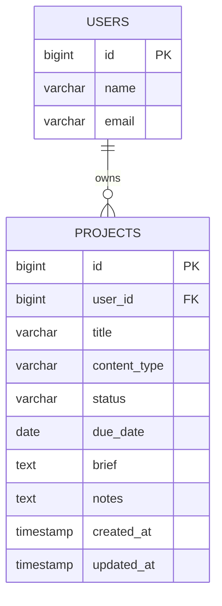

# Content Production Tracker

A Laravel + Inertia + Vue single-page application that helps an intern, their mentors, and teams track content production projects — ebooks, blog posts, newsletters, and social posts — from draft through completion.

Built on the official Laravel Vue starter kit with teams, authentication, and a settings area, extended with a user-scoped **Projects** module.

---

## Table of contents

1. [Features](#features)
2. [Tech stack](#tech-stack)
3. [Requirements](#requirements)
4. [Quick start](#quick-start)
5. [Available commands](#available-commands)
6. [Project structure](#project-structure)
7. [Routes and pages](#routes-and-pages)
8. [Environment variables](#environment-variables)
9. [Testing](#testing)
10. [Code quality](#code-quality)
11. [Projects feature specification](#projects-feature-specification)

---

## Features

- **Authentication** — registration, login, logout, and password reset powered by Laravel Fortify.
- **Teams** — create personal and shared teams, manage members, send/cancel invitations, and switch between teams.
- **Projects** — a protected `/projects` page listing only the authenticated user's content projects, newest first, with an empty state for new accounts.
- **Dashboard** — role-based home page showing internship progress and pending team invitations.
- **Settings** — profile update, password/security, and light/dark appearance preferences.
- **Frontend** — Inertia v3 SPA with typed Vue 3 components and Tailwind CSS v4 UI components.
- **No seed credentials leak into production** — seeded demo credentials are injected through environment variables with safe test defaults.

---

## Tech stack

| Layer           | Technology                                                                                                  |
| --------------- | ----------------------------------------------------------------------------------------------------------- |
| Backend         | PHP 8.4+, [Laravel 13](https://laravel.com), Laravel Fortify                                                |
| Frontend        | [Inertia.js v3](https://inertiajs.com), [Vue 3](https://vuejs.org) (`<script setup lang="ts">`), TypeScript |
| Styling         | Tailwind CSS v4, shadcn-style Vue UI components (reka-ui)                                                   |
| Routing helpers | [Laravel Wayfinder](https://github.com/laravel/wayfinder) — typed `@/routes/*` helpers                      |
| Bundler         | Vite (via [vite-plus](https://www.npmjs.com/package/vite-plus))                                             |
| Testing         | Pest PHP v5, PHPUnit under the hood                                                                         |
| Quality         | Laravel Pint, PHPStan (Larastan), Rector                                                                    |
| Database        | MySQL in dev/production; SQLite for tests                                                                   |

---

## Requirements

- PHP **8.4+** (with extensions required by Laravel)
- Composer 2
- Node.js **22+** (Node 24 works) and npm
- One of: MySQL / MariaDB, PostgreSQL, SQLite, SQL Server (any Laravel-supported driver)

---

## Quick start

```bash
# 1) Install PHP dependencies
composer install

# 2) Create and configure your environment file
cp .env.example .env          # Windows:  copy .env.example .env

# 3) Generate the app key, configure your DB_* values, then migrate
php artisan key:generate
php artisan migrate

# 4) Install frontend dependencies
npm install

# 5) Start the app (server + queue worker + Vite dev server)
composer run dev
```

Open <http://localhost:8000> and register a new account, or follow the migration and seed steps below to load demo data.

### One-command setup

`composer run setup` runs install, env creation, key generation, migration, npm install, and the production build.

### Database migration

After configuring your Database Credentials and Database Seeder Credentials values in `.env`, create the schema:

```bash
php artisan migrate
```

This creates the `users`, `teams`, `projects`, password-reset, cache, and queue tables.

Useful variants:

- `php artisan migrate:fresh` — drop all tables and migrate from scratch.
- `php artisan migrate:status` — show which migrations have run.

### Database seeding

Load the demo data:

```bash
php artisan db:seed
```

This creates **one demo user** and **10 content projects** owned by that user (via the `DatabaseSeeder`). The user's own `ProjectFactory` assigns random but valid content types and statuses defined by the `ProjectContentType` / `ProjectStatus` enums.

### Demo login

After `php artisan db:seed`, sign in at <http://localhost:8000/login> with: Email, Password
Both values come from the `SEEDER_USER_EMAIL` and `SEEDER_USER_PASSWORD` environment variables, so they can be changed without touching source code.

---

## Available commands

| Command                    | Purpose                                                                     |
| -------------------------- | --------------------------------------------------------------------------- |
| `composer run dev`         | Start server, queue worker, and Vite dev server together                    |
| `php artisan serve`        | Start only the HTTP server                                                  |
| `npm run dev`              | Run the Vite dev server (hot reload)                                        |
| `npm run build`            | Production build (also regenerates Wayfinder route helpers + Vite manifest) |
| `npm run build:ssr`        | Build plus SSR bundle                                                       |
| `php artisan test`         | Run the full test suite                                                     |
| `vendor\bin\pest`          | Run Pest directly (Windows)                                                 |
| `vendor\bin\pint`          | Fix PHP code style                                                          |
| `vendor\bin\pint --test`   | Check code style without modifying (`npm run lint:check`)                   |
| `php artisan db:seed`      | Seed the database with demo user + projects                                 |
| `npm run types:check`      | TypeScript type-check via `vue-tsc`                                         |
| `npm run check`            | Frontend lint/format check (eslint-style)                                   |
| `npm run check:fix`        | Auto-fix frontend lint/format issues                                        |
| `composer run types:check` | PHPStan static analysis                                                     |
| `composer run format`      | Rector + Pint                                                               |
| `composer run ci:check`    | Full CI pipeline: frontend check → types → test                             |

> **Note:** after changing a Laravel route, run `npm run build` (or `npm run dev`) so Wayfinder regenerates the typed route helpers under `resources/js/routes`.

---

## Project structure

```
app/
├── Actions/                    # Fortify actions (account creation, password reset)
├── Concerns/                   # Shared traits (password rules, teams)
├── Enums/                      # Backed enums (TeamRole, ProjectStatus, ProjectContentType)
├── Http/
│   ├── Controllers/            # Dashboard, Project, Teams/*, Settings/*
│   └── Requests/               # Form requests incl. Store/UpdateProjectRequest validation
├── Models/                     # Project, User, Team, Membership, TeamInvitation
├── Policies/                   # Authorization policies
└── Rules/                      # Custom validation rules

database/
├── factories/                  # UserFactory, ProjectFactory, TeamFactory
├── migrations/                 # users, teams, projects, cache, jobs, ...
└── seeders/DatabaseSeeder.php  # Seeds demo user + 10 projects (credentials via env)

resources/
├── js/
│   ├── app.ts                  # Inertia bootstrap + layout resolution
│   ├── components/             # App shell, sidebar, UI kit (ui/*), modals
│   ├── pages/                  # Inertia pages: Dashboard, Projects, teams/*, settings/*, auth/*
│   ├── layouts/                # AppLayout, AuthLayout, SettingsLayout
│   ├── routes/                 # Wayfinder-generated typed route helpers (do not edit)
│   └── types/                  # Shared TypeScript types (Project, Team, NavItem, ...)
└── views/app.blade.php         # Inertia bootstrap view

routes/
├── web.php                     # Welcome, /projects, team-prefixed dashboard
└── settings.php                # Settings area routes

tests/
├── Feature/                    # Feature tests (auth, teams, dashboard, projects)
└── Unit/                       # Unit tests (Project model/factory, seeder credentials)
```

---

## Routes and pages

| Route                                                             | Visibility    | Page         |
| ----------------------------------------------------------------- | ------------- | ------------ |
| `/`                                                               | Public        | Welcome      |
| `/login`, `/register`, `/forgot-password`                         | Guest only    | auth pages   |
| `/projects`                                                       | Authenticated | **Projects** |
| `/{team}/dashboard`                                               | Team member   | Dashboard    |
| `/settings/profile`, `/settings/security`, `/settings/appearance` | Authenticated | Settings     |
| `/settings/teams`                                                 | Authenticated | Teams        |

When signed in, the sidebar navigation ("Platform") links to **Dashboard** and **Projects**.

### Projects page


- Protected route — guests are redirected to login.
- Renders **only** the authenticated user's projects (`ProjectController::index` queries `$request->user()->projects()`).
- Displays **Title**, **Content type**, **Status** (badge), and **Due date** per project.
- Shows a heading, a total project count, and a clear empty state when there are no projects.
- Empty dates render a safe `—` placeholder.
- Projects are ordered newest → oldest.
- No create/edit/delete actions in this version.

---

## Environment variables

Copy `.env.example` to `.env` and adjust. Key variables:

| Variable                                            | Purpose                                                   | Default                                     |
| --------------------------------------------------- | --------------------------------------------------------- | ------------------------------------------- |
| `APP_NAME`, `APP_ENV`, `APP_URL`                    | Application identity and environment                      | `Laravel`, `local`, `http://localhost:8000` |
| `APP_DEBUG`                                         | Detailed debug output                                     | `true`                                      |
| `APP_KEY`                                           | Encryption key (generate with `php artisan key:generate`) | —                                           |
| `DB_*`                                              | Database connection                                       | MySQL defaults                              |
| `SESSION_DRIVER`, `CACHE_STORE`, `QUEUE_CONNECTION` | Drivers                                                   | `database`                                  |
| `MAIL_*`                                            | Mail configuration                                        | `log` mailer                                |
| `SEEDER_USER_NAME`                                  | Name of the seeded demo user                              | `Intern Test`                               |
| `SEEDER_USER_EMAIL`                                 | Email of the seeded demo user                             | `intern@example.test`                       |
| `SEEDER_USER_PASSWORD`                              | Password of the seeded demo user                          | `password`                                  |

> **Security:** seeded credentials come from environment variables, never hardcoded. The `.test` TLD default is reserved and non-routable, so no production-credential can be committed. A unit test (`tests/Unit/SeederCredentialTest`) enforces this.

### AI configuration

The content-plan generation feature calls the OpenAI API from the Laravel backend. Set these values in `.env`:

| Variable         | Purpose                               | Default |
| ---------------- | ------------------------------------- | ------- |
| `OPENAI_API_KEY` | Server-side OpenAI API key            | —       |
| `OPENAI_MODEL`   | OpenAI model used for plan generation | —       |

The key is read through `config/services.php` and is never exposed to the browser. `tests/Unit/OpenAIConfigTest` enforces that application code uses `config()` rather than `env()` directly.

---

## Testing

Pest v5 runs the suite. The global `tests/Pest.php` applies `RefreshDatabase` to Feature and Unit tests.

```bash
# Full suite
php artisan test --compact

# Target specific tests
php artisan test tests/Feature/ProjectsTest.php
vendor\bin\pest tests/Unit

# A single test by name
php artisan test --filter='guests are redirected to the login page'
```

Feature tests cover guests being redirected to login, authenticated access, user-scoped data isolation (a user never sees another user's projects), and ordering.

---

## Code quality

- **Pint** — PHP code style: `vendor\bin\pint --dirty`
- **PHPStan (Larastan)** — static analysis: `composer run types:check`
- **Rector** — refactoring: `composer run format`
- **vue-tsc** — TypeScript type-checking: `npm run types:check`
- **vite-plus check** — frontend lint/format: `npm run check`
- **CI** — `composer run ci:check` runs frontend checks, TypeScript checks, and the full test suite.

---

## Projects feature specification

### 1. Project model fields

| Field          | Requirement                                              |
| -------------- | -------------------------------------------------------- |
| `id`           | Primary key                                              |
| `user_id`      | Owner of the project                                     |
| `title`        | Required, maximum 150 characters                         |
| `content_type` | Required string, maximum 50 characters                   |
| `status`       | Required string, maximum 30 characters                   |
| `due_date`     | Optional date                                            |
| `brief`        | Optional text containing the user's content instructions |
| `notes`        | Optional text                                            |
| `created_at`   | Creation time                                            |
| `updated_at`   | Last update time                                         |

### 2. Allowed values (first version)

**Content types** (enum `ProjectContentType`): Ebook, Blog post, Newsletter, Social post.

**Statuses** (enum `ProjectStatus`): Draft, In progress, Review, Complete.

The enums are the single source of truth: the factory and `StoreProjectRequest` / `UpdateProjectRequest` validation derive their allowed values from `ProjectContentType::values()` / `ProjectStatus::values()`.

### 3. Business rules

- A project belongs to one user.
- A user can have many projects.
- A user can view only their own projects.
- A guest cannot open the Projects page (redirected to login).
- The newest projects appear first.
- An empty account displays a clear empty state.

### 4. Mermaid database diagram



### Relationship explanation

A **user** owns many projects, while each **project** belongs to exactly one user. Because a project has only one owner, the foreign key `user_id` is stored on the `projects` (many) side of the relationship, pointing back to the `users` (one) side. This is a standard one-to-many relationship: the `user_id` column in the `projects` table is what links every project back to its owner, and retrieving `$user->projects` or `$project->user` relies on that single column.
