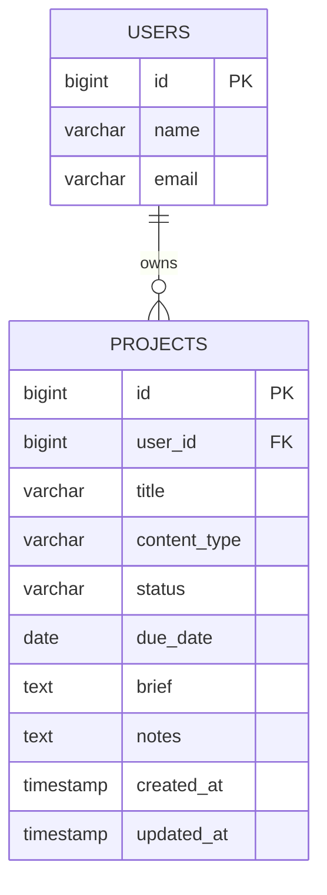

# Content Production Tracker — Projects Feature Specification

This document specifies the first version of a **content project** and the rules that govern it.

## 1. Project model fields

Each project must contain the following fields:

| Field | Requirement |
| --- | --- |
| `id` | Primary key |
| `user_id` | Owner of the project |
| `title` | Required, maximum 150 characters |
| `content_type` | Required string, maximum 50 characters |
| `status` | Required string, maximum 30 characters |
| `due_date` | Optional date |
| `brief` | Optional text containing the user's content instructions |
| `notes` | Optional text |
| `created_at` | Creation time |
| `updated_at` | Last update time |

## 2. Allowed values (first version)

**Content types:**

- Ebook
- Blog post
- Newsletter
- Social post

**Statuses:**

- Draft
- In progress
- Review
- Complete

## 3. Business rules

- A project belongs to one user.
- A user can have many projects.
- A user can view only their own projects.
- A guest cannot open the Projects page (redirected to login).
- The newest projects appear first.
- An empty account displays a clear empty state.

## 4. Mermaid database diagram

### Relationship explanation

A **user** owns many projects, while each **project** belongs to exactly one user. Because a project has only one owner, the foreign key `user_id` is stored on the `projects` (many) side of the relationship, pointing back to the `users` (one) side. This is a standard one-to-many relationship: the `user_id` column in the `projects` table is what links every project back to its owner, and retrieving `$user->projects` or `$project->user` relies on that single column.

## Step 5 — The Project model and migration complete.
* Project table  have all columns an foreign key
* $user->projects returns the user's projects.
* $project->user returns the project owner.

## Step 6 — Factory and sample data added.
* A fresh database can receive all sample data with one seed command.
* Every sample project has an owner.
* The seeded projects use valid content types and statuses.
* No production credential appears in the seeder.

## Step 7 — Protected Projects page added 